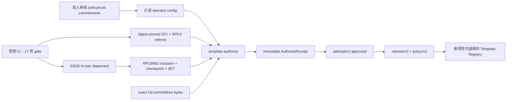

# Template Artifact Authority 运维契约

状态日期：2026-07-23。

本文描述如何把外部 Template Candidate 经过真实 Git、OCI、SPDX、DSSE 和透明日志
验证后，原子写成不可变 `TemplateRelease`。这是 operator/CI 管理面，不是浏览器、
普通平台 API 或 Agent 工具。当前实现不会自动批准
`https://github.com/ai-worksflow/templates.git`；该上游仍须补齐审计账本列出的材料。

## 1. 信任边界和闭环



准入请求只能提供 Candidate、固定制品/SBOM 引用、原始 DSSE/透明日志 bundle、
Attempt/Release 操作 ID，以及相互独立的请求人与评估人。它不能提供或覆盖：

- gate evidence、通过/拒绝结论或 Release policy；
- signer identity、public key、trust root 或 policy hash；
- verified/created/approved 时间或 Receipt ID；
- Registry Authorization、PostgreSQL DSN 或其他服务端凭据。

这些值由 operator 配置、真实验证结果、可信时钟和数据库状态机派生。

## 2. 运行模式

后端镜像同时包含 `/usr/local/bin/template-authority`。它只有六个显式模式：

1. `commitments`：离线读取 public key，规范化并计算 policy/trust digest；不连接
   PostgreSQL、Git 或 Registry。
2. `prepare-admission`：在隔离 signer/CI 环境中真实读取固定摘要的 OCI image 和 SPDX
   referrer，计算 aggregate SBOM/subject，绑定 16 项外部 gate，生成第 17 项
   `signature_attestation`，并创建 DSSE in-toto envelope 与规范化透明证明；不读取 Git、
   不连接 PostgreSQL。
3. `readiness`：检查 reviewed commitment、PostgreSQL migration 55、真实 Git
   executable/cache，以及所有 Registry/redirect host 的 DNS/public-IP readiness；不发送
   Registry GET。
4. `verify-admission`：执行与准入相同的 Git、OCI、SPDX、DSSE 和透明证明验证并返回将要
   写入的 Receipt，但不打开写事务、不改变 Release 状态；用于安全的 operator preflight。
5. `admit`：先执行完整 readiness，再独立读取 Git/Registry 字节和验证全部密码学证明，最后以
   serializable transaction 写 Receipt → Attempt → Release → Policy。
6. `register-stack`：先执行完整 readiness，只读取两个或更多已批准的精确 Release，
   再以 serializable transaction 写不可变 FullStackTemplate 及其 component projections。

示例配置位于
`deploy/template-authority-config.example.json`。示例里的 verifier digest、Registry、
key 和空 commitment 都是占位符，不能用于批准 Release。

先由安全审阅流程计算承诺：

```sh
docker run --rm \
  --entrypoint /usr/local/bin/template-authority \
  -v "$PWD/deploy/template-authority-config.json:/run/authority/config.json:ro" \
  -v "$PWD/trust:/run/worksflow/trust:ro" \
  worksflow-builder-api:<immutable-tag> \
  -mode commitments -config /run/authority/config.json
```

把输出的 `policyHash` 和 `trustRootDigest` 经过独立审阅后，分别固定到
`expectedPolicyHash`、`expectedTrustRootDigest`。任何 key、threshold、allowlist、限制、
predicate、超时或 verifier image 变化都会使启动 fail closed。

prepare-admission/readiness/verify-admission/admit/register-stack 额外只从环境读取：

- `WORKSFLOW_TEMPLATE_AUTHORITY_POSTGRES_DSN`；
- 配置中每个 `authorizationEnv` 指向的完整 HTTP Authorization 值，例如
  `Bearer ...`。对于必须保持 Private 的 GHCR Package，可提供由专用机器用户和
  `read:packages` PAT classic 组成的 `Basic base64(username:PAT)`；operator 只接受 Registry
  origin 返回的同源 HTTPS Bearer challenge，以精确 `repository:<name>:pull` scope 交换短期
  token，再重试固定摘要请求。Basic 不会发送到 manifest/blob 端点：operator 先匿名获取并
  验证 challenge，再只向同源 token endpoint 披露 Basic。Basic/Bearer 值不会跟随 CDN redirect，也不会写入 policy
  document、输出或错误消息。

GitHub Packages 不支持用 GitHub App installation token 代替外部 Registry 凭据。PAT 应只
授予 `read:packages`，需要时完成组织 SSO 授权，并通过 Secret 管理器注入
`WORKSFLOW_TEMPLATE_REGISTRY_AUTHORIZATION`；不要写入配置文件、镜像、仓库或 shell 历史。
本地 staging 可运行 `deploy/configure-template-authority-ghcr.sh`，它以静默交互读取 PAT、
验证 classic token 格式、生成 `Basic base64(username:PAT)`，并用 owner-only 权限原子替换
被 Git 忽略的 `deploy/.env.template-authority.local`；脚本不会回显 PAT。

推荐把配置/key 作为只读 Secret/ConfigMap 挂载，把 Git cache 作为仅 operator 用户可写的
持久卷，并用独立 PostgreSQL role。该 role 至少需要读取 `schema_migrations`、`users` 和
Template Registry lineage，且仅能插入 Authority Receipt/Release/Policy、更新自己创建的
Admission Attempt；不要复用 API 超级用户，也不要给浏览器网络路由。

## 3. Prepare-admission 输入

输入 schema 是 `template-artifact-authority-evidence-preparation/v1`。它包含与 Admit 相同的
Attempt/Release/Candidate lineage，但 `candidate.sbomDigest` 必须为空；该值只能从实际
Registry 字节计算。除此之外还包含：

- 精确 `artifactReference` 和每个 manifest service 的 image/referrer 引用；
- CI 产生的 16 项非签名 gate；输入不得包含 `subjectHash` 或
  `signature_attestation` 的权威值，operator 会重新绑定/生成；
- reviewed DSSE `keyId`/PKCS8 private-key file，以及 reviewed transparency
  `logId`/`keyId`/PKCS8 private-key file；private key 必须是 owner-only 的普通非 symlink 文件；
- 允许的 DSSE payload type、稳定的 verification reference，以及互不相同的请求人/评估人。

```sh
docker run --rm \
  --entrypoint /usr/local/bin/template-authority \
  --env-file /run/secrets/template-authority.env \
  -v /run/authority:/run/authority:ro \
  -v /run/worksflow/signing:/run/worksflow/signing:ro \
  worksflow-builder-api:<immutable-tag> \
  -mode prepare-admission \
  -config /run/authority/config.json \
  -input /run/authority/evidence-preparation.json \
  > /run/authority/admission.json
```

生成的 `admission.json` 不含 private key 或 Registry credential，可交给隔离的 admission
operator；但它仍是敏感的发布控制面材料，应使用不可变 artifact store 和最小权限交接。
`prepare-admission` 生成的一条 `treeSize=1` 规范化透明证明适合隔离 staging 闭环验证，不能
冒充外部生产 transparency log；生产环境仍须接入并资格化真实 Rekor/Fulcio 或等价服务。

## 4. Admit 输入

输入 schema 是 `template-artifact-authority-admission/v1`：

```json
{
  "schemaVersion": "template-artifact-authority-admission/v1",
  "attemptId": "<uuid>",
  "releaseId": "<uuid>",
  "candidate": {
    "source": {
      "repository": "https://github.com/example/templates.git",
      "branch": "api",
      "commit": "<exact-git-object-id>",
      "treeHash": "sha256:<raw-ls-tree-sha256>"
    },
    "manifest": "<template-manifest/v1 object>",
    "sbomDigest": "sha256:<aggregate-service-sbom-digest>",
    "licenseExpression": "Apache-2.0",
    "licenseDigest": "sha256:<license-bytes-digest>"
  },
  "bundle": {
    "artifactReference": "registry.example.com/worksflow/templates@sha256:<manifest>",
    "serviceSboms": "<one exact image/referrer pair per manifest service>",
    "dsseEnvelope": "<DSSE JSON object>",
    "transparencyBundle": "<proof JSON object>",
    "verificationReference": "urn:worksflow:template-verification:<stable-id>"
  },
  "requestedBy": "<requester-user-uuid>",
  "evaluatedBy": "<different-evaluator-user-uuid>"
}
```

上面的字符串占位只是字段说明；真实 `manifest`、`serviceSboms`、`dsseEnvelope` 和
`transparencyBundle` 必须是对应 JSON object/array。decoder 会拒绝 unknown field、重复
JSON key、尾随值和超限输入。

执行：

```sh
docker run --rm \
  --entrypoint /usr/local/bin/template-authority \
  --env-file /run/secrets/template-authority.env \
  -v /run/authority:/run/authority:ro \
  -v /run/worksflow/trust:/run/worksflow/trust:ro \
  -v template-source-cache:/var/lib/worksflow/template-sources \
  worksflow-builder-api:<immutable-tag> \
  -mode admit \
  -config /run/authority/config.json \
  -input /run/authority/admission.json
```

成功输出 canonical registration，包含 exact AuthorityReceipt、approved Attempt、Release
和 policy。失败不会留下半条 Receipt 或可选择 Release；数据库约束拒绝 Receipt 更新、
删除、index/document 漂移、v1 新批准和不精确 lineage。

## 5. Register-stack 输入

`register-stack` 只能组合 `admit` 已批准的精确 Release；输入 schema 是
`template-artifact-authority-full-stack-registration/v1`：

```json
{
  "schemaVersion": "template-artifact-authority-full-stack-registration/v1",
  "id": "<uuid>",
  "templateId": "youtube-platform",
  "version": "1.0.0",
  "components": [
    {
      "role": "web",
      "mountPath": "apps/web",
      "release": {
        "id": "<approved-web-release-uuid>",
        "contentHash": "sha256:<exact-release-content-hash>",
        "subjectHash": "sha256:<exact-release-subject-hash>"
      }
    },
    {
      "role": "api",
      "mountPath": "services/api",
      "release": {
        "id": "<approved-api-release-uuid>",
        "contentHash": "sha256:<exact-release-content-hash>",
        "subjectHash": "sha256:<exact-release-subject-hash>"
      }
    }
  ],
  "layout": {
    "contractTruthSource": "openapi",
    "openapiPath": "contracts/openapi.yaml",
    "generatedClientPath": "packages/api-client",
    "deploymentPath": "deployment",
    "testPath": "tests",
    "databaseEngine": "postgresql"
  },
  "createdBy": "<operator-user-uuid>"
}
```

`createdAt` 和最终 `contentHash` 不属于请求字段：时间取 operator 可信时钟，内容哈希由
规范化后的不可变文档计算。组件必须包含恰好一个 web 和一个 api，路径不得重叠，每个
Release 的 ID/contentHash/subjectHash 必须同时匹配 Registry 中当前已批准的精确记录。

```sh
docker run --rm \
  --entrypoint /usr/local/bin/template-authority \
  --env-file /run/secrets/template-authority.env \
  -v /run/authority:/run/authority:ro \
  -v /run/worksflow/trust:/run/worksflow/trust:ro \
  -v template-source-cache:/var/lib/worksflow/template-sources \
  worksflow-builder-api:<immutable-tag> \
  -mode register-stack \
  -config /run/authority/config.json \
  -input /run/authority/full-stack-registration.json
```

## 6. 已验证与尚未资格化

仓库级实现已经覆盖：

- 原始 `git ls-tree -r --full-tree -z` tree digest 和每个 blob 的重新读取；
- OCI manifest/config/有序 layer 的 digest、size、media type、总量和 redirect 策略；
- 每个服务的同 repository SPDX in-toto referrer 与确定性聚合 digest；
- Ed25519/ECDSA-SHA256 DSSE threshold、exact subject/predicate；
- RFC6962 inclusion、checkpoint 与 SET 双签名、freshness/skew；
- migration 55 的 immutable receipt、v2 exact lineage 和 legacy v1 non-selectable 规则。

仍不能声称生产资格完成：

- 尚未针对目标 Registry、企业 CA、KMS/Secret Broker 和真实网络故障做环境资格测试；
- 当前透明证明是严格的规范化 bundle verifier，不等同于已集成/资格化原生
  Rekor/Fulcio client；
- `ai-worksflow/templates` 的两个候选已具备 manifest/lock/license、可复现 CI artifact、
  SPDX referrer 和 16 项 gate；仍缺独立 `signature_attestation`、生产信任根/透明日志证明，
  且 GHCR 包必须允许 operator 读取，因而尚无 approved Golden Release；
- verifier image digest 必须由发布流水线实际构建、签名并固定，示例零 digest 不是证据。

这些条件满足前，operator 应保持 disabled，或只在隔离 staging 中执行拒绝路径验证。
