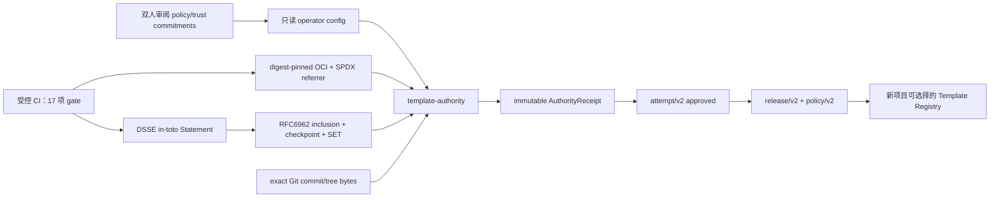

# Template Artifact Authority 运维契约

状态日期：2026-07-18。

本文描述如何把外部 Template Candidate 经过真实 Git、OCI、SPDX、DSSE 和透明日志
验证后，原子写成不可变 `TemplateRelease`。这是 operator/CI 管理面，不是浏览器、
普通平台 API 或 Agent 工具。当前实现不会自动批准
`https://github.com/ai-worksflow/templates.git`；该上游仍须补齐审计账本列出的材料。

## 1. 信任边界和闭环



准入请求只能提供 Candidate、固定制品/SBOM 引用、原始 DSSE/透明日志 bundle、
Attempt/Release 操作 ID，以及相互独立的请求人与评估人。它不能提供或覆盖：

- gate evidence、通过/拒绝结论或 Release policy；
- signer identity、public key、trust root 或 policy hash；
- verified/created/approved 时间或 Receipt ID；
- Registry Authorization、PostgreSQL DSN 或其他服务端凭据。

这些值由 operator 配置、真实验证结果、可信时钟和数据库状态机派生。

## 2. 运行模式

后端镜像同时包含 `/usr/local/bin/template-authority`。它只有三个显式模式：

1. `commitments`：离线读取 public key，规范化并计算 policy/trust digest；不连接
   PostgreSQL、Git 或 Registry。
2. `readiness`：检查 reviewed commitment、PostgreSQL migration 55、真实 Git
   executable/cache，以及所有 Registry/redirect host 的 DNS/public-IP readiness；不发送
   Registry GET。
3. `admit`：先执行完整 readiness，再验证所有远端字节和密码学证明，最后以
   serializable transaction 写 Receipt → Attempt → Release → Policy。

示例配置位于
`deploy/template-authority-config.example.json`。示例里的 verifier digest、Registry、
key 和空 commitment 都是占位符，不能用于批准 Release。

先由安全审阅流程计算承诺：

```sh
docker run --rm \
  --entrypoint /usr/local/bin/template-authority \
  -v "$PWD/deploy/template-authority-config.json:/run/authority/config.json:ro" \
  -v "$PWD/trust:/run/worksflow/trust:ro" \
  worksflow-builder-api:<immutable-tag> \
  -mode commitments -config /run/authority/config.json
```

把输出的 `policyHash` 和 `trustRootDigest` 经过独立审阅后，分别固定到
`expectedPolicyHash`、`expectedTrustRootDigest`。任何 key、threshold、allowlist、限制、
predicate、超时或 verifier image 变化都会使启动 fail closed。

readiness/admit 额外只从环境读取：

- `WORKSFLOW_TEMPLATE_AUTHORITY_POSTGRES_DSN`；
- 配置中每个 `authorizationEnv` 指向的完整 HTTP Authorization 值，例如
  `Bearer ...`。值不会写入 policy document、输出或错误消息。

推荐把配置/key 作为只读 Secret/ConfigMap 挂载，把 Git cache 作为仅 operator 用户可写的
持久卷，并用独立 PostgreSQL role。该 role 至少需要读取 `schema_migrations`、`users` 和
Template Registry lineage，且仅能插入 Authority Receipt/Release/Policy、更新自己创建的
Admission Attempt；不要复用 API 超级用户，也不要给浏览器网络路由。

## 3. Admit 输入

输入 schema 是 `template-artifact-authority-admission/v1`：

```json
{
  "schemaVersion": "template-artifact-authority-admission/v1",
  "attemptId": "<uuid>",
  "releaseId": "<uuid>",
  "candidate": {
    "source": {
      "repository": "https://github.com/example/templates.git",
      "branch": "api",
      "commit": "<exact-git-object-id>",
      "treeHash": "sha256:<raw-ls-tree-sha256>"
    },
    "manifest": "<template-manifest/v1 object>",
    "sbomDigest": "sha256:<aggregate-service-sbom-digest>",
    "licenseExpression": "Apache-2.0",
    "licenseDigest": "sha256:<license-bytes-digest>"
  },
  "bundle": {
    "artifactReference": "registry.example.com/worksflow/templates@sha256:<manifest>",
    "serviceSboms": "<one exact image/referrer pair per manifest service>",
    "dsseEnvelope": "<DSSE JSON object>",
    "transparencyBundle": "<proof JSON object>",
    "verificationReference": "urn:worksflow:template-verification:<stable-id>"
  },
  "requestedBy": "<requester-user-uuid>",
  "evaluatedBy": "<different-evaluator-user-uuid>"
}
```

上面的字符串占位只是字段说明；真实 `manifest`、`serviceSboms`、`dsseEnvelope` 和
`transparencyBundle` 必须是对应 JSON object/array。decoder 会拒绝 unknown field、重复
JSON key、尾随值和超限输入。

执行：

```sh
docker run --rm \
  --entrypoint /usr/local/bin/template-authority \
  --env-file /run/secrets/template-authority.env \
  -v /run/authority:/run/authority:ro \
  -v /run/worksflow/trust:/run/worksflow/trust:ro \
  -v template-source-cache:/var/lib/worksflow/template-sources \
  worksflow-builder-api:<immutable-tag> \
  -mode admit \
  -config /run/authority/config.json \
  -input /run/authority/admission.json
```

成功输出 canonical registration，包含 exact AuthorityReceipt、approved Attempt、Release
和 policy。失败不会留下半条 Receipt 或可选择 Release；数据库约束拒绝 Receipt 更新、
删除、index/document 漂移、v1 新批准和不精确 lineage。

## 4. 已验证与尚未资格化

仓库级实现已经覆盖：

- 原始 `git ls-tree -r --full-tree -z` tree digest 和每个 blob 的重新读取；
- OCI manifest/config/有序 layer 的 digest、size、media type、总量和 redirect 策略；
- 每个服务的同 repository SPDX in-toto referrer 与确定性聚合 digest；
- Ed25519/ECDSA-SHA256 DSSE threshold、exact subject/predicate；
- RFC6962 inclusion、checkpoint 与 SET 双签名、freshness/skew；
- migration 55 的 immutable receipt、v2 exact lineage 和 legacy v1 non-selectable 规则。

仍不能声称生产资格完成：

- 尚未针对目标 Registry、企业 CA、KMS/Secret Broker 和真实网络故障做环境资格测试；
- 当前透明证明是严格的规范化 bundle verifier，不等同于已集成/资格化原生
  Rekor/Fulcio client；
- `ai-worksflow/templates` 仍缺完整合规 manifest/lock/license/CI artifact/SBOM/签名证据，
  因而没有 approved Golden Release；
- verifier image digest 必须由发布流水线实际构建、签名并固定，示例零 digest 不是证据。

这些条件满足前，operator 应保持 disabled，或只在隔离 staging 中执行拒绝路径验证。
